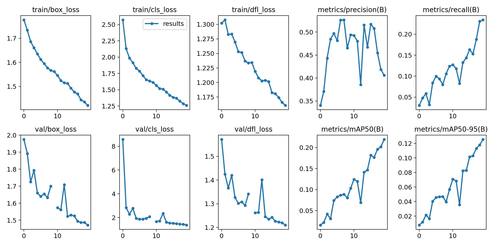
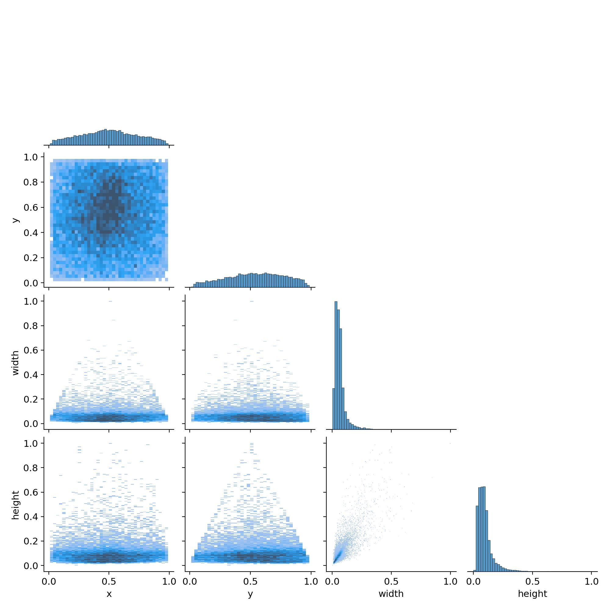
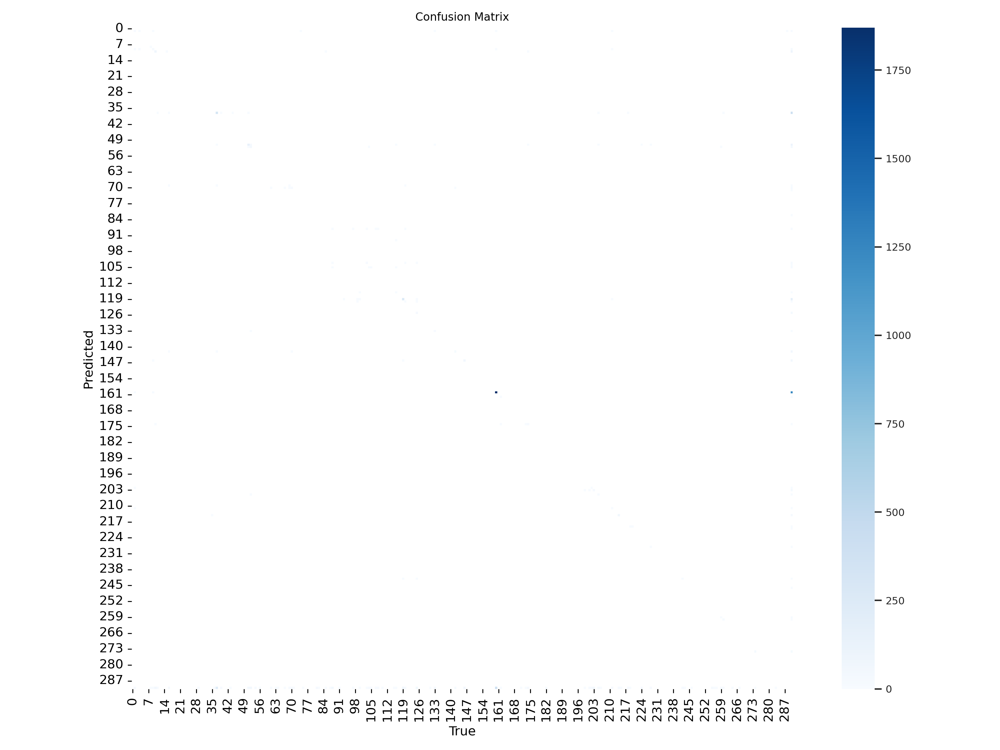
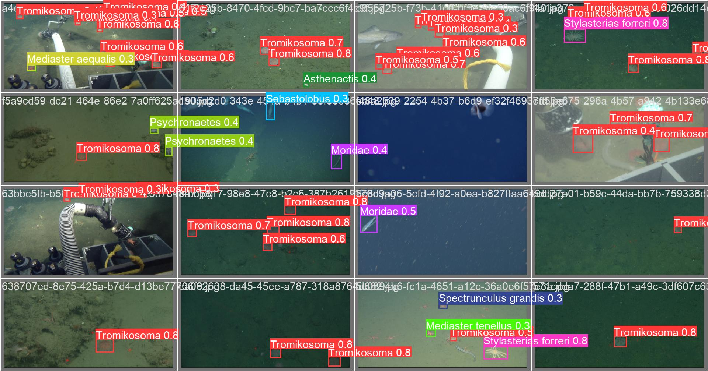
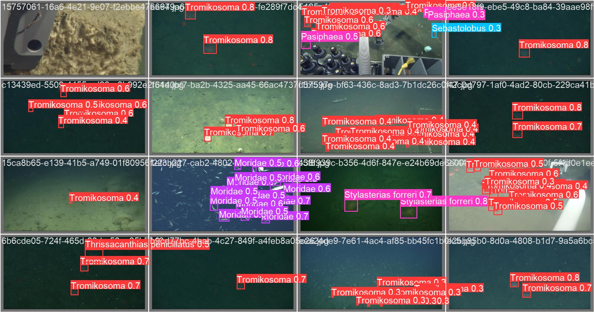
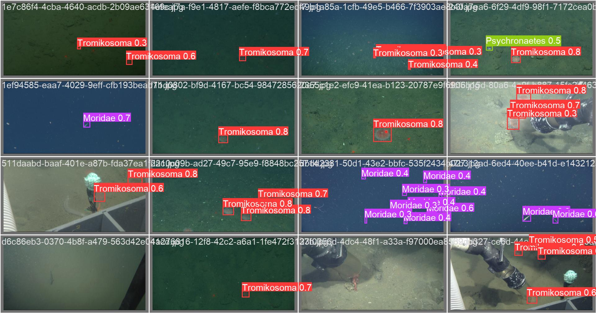

DOWNLOAD IMAGES


```python
import os
import json
import requests
import shutil
import numpy as np
import pandas as pd

import json

from PIL import Image, ImageDraw
from pathlib import Path

```


```python
INPUT_DIR = Path('/kaggle/input/fathomnet-out-of-sample-detection')
OUTPUT_DIR_RAW = Path('/kaggle/working/raw')
OUTPUT_DIR = Path('/kaggle/working/dataset')
TRAIN_IMGS_DIR = OUTPUT_DIR / 'imgs' / 'train'
TRAIN_LABELS_DIR = OUTPUT_DIR / 'labels' / 'train'
VAL_IMGS_DIR = OUTPUT_DIR / 'imgs'/ 'val'
VAL_LABELS_DIR = OUTPUT_DIR / 'labels' / 'val'
TEST_IMGS_DIR = OUTPUT_DIR / 'imgs' / 'test'


RANDOM_STATE = 42
SAMPLE_SIZE = 1.0

```


```python
def read_json(filename):
    return json.load(open(filename, "r"))

def read_csv(filename):
    return pd.read_csv(filename).set_index('id')

def download_image(image):
    if not os.path.exists(image[0]):
        resp = requests.get(image[1], stream=True)
        resp.raw.decode_content = True
        with open(image[0], 'wb') as f:
            shutil.copyfileobj(resp.raw, f)
    
```


```python
# from multiprocessing.pool import ThreadPool

# def delete_empty_files(folder_path):
#     for file_name in os.listdir(folder_path):
#         file_path = os.path.join(folder_path, file_name)
#         if os.path.isfile(file_path) and os.path.getsize(file_path) == 0:
#             os.remove(file_path)

# def download(split, data_json):
#     delete_empty_files(f"/kaggle/working/raw/{split}/")
#     train_imgs = [
#         [f"/kaggle/working/raw/{split}/" + i["file_name"], i["coco_url"]]
#         for i in train_json["images"]
#         if not os.path.exists(f"/kaggle/working/raw/{split}/"+i["file_name"])
#     ]
#     pool = ThreadPool(10000)
#     results = pool.map(download_image, train_imgs)
#     pool.close()
#     pool.join()
```


```python
train_json = read_json(INPUT_DIR / "object_detection/train.json")
```


```python
# download('train', train_json)
```


```python
# eval_json = read_json(INPUT_DIR / "object_detection/eval.json")
# download('eval', eval_json)
```

EXPLORE


```python
def get_annotations(json_data):
    df = pd.json_normalize(json_data['annotations'])
    return df.set_index('id')

def get_image_data(json_data):
    df = pd.json_normalize(json_data['images'])
    return df.set_index('id')
```


```python
annotation_data = get_annotations(train_json)
display(annotation_data)

```


<div>
<style scoped>
    .dataframe tbody tr th:only-of-type {
        vertical-align: middle;
    }

    .dataframe tbody tr th {
        vertical-align: top;
    }

    .dataframe thead th {
        text-align: right;
    }
</style>
<table border="1" class="dataframe">
  <thead>
    <tr style="text-align: right;">
      <th></th>
      <th>image_id</th>
      <th>category_id</th>
      <th>segmentation</th>
      <th>area</th>
      <th>bbox</th>
      <th>iscrowd</th>
    </tr>
    <tr>
      <th>id</th>
      <th></th>
      <th></th>
      <th></th>
      <th></th>
      <th></th>
      <th></th>
    </tr>
  </thead>
  <tbody>
    <tr>
      <th>1</th>
      <td>1</td>
      <td>1.0</td>
      <td>[]</td>
      <td>7869.0</td>
      <td>[347.0, 188.0, 129.0, 61.0]</td>
      <td>0</td>
    </tr>
    <tr>
      <th>2</th>
      <td>2</td>
      <td>1.0</td>
      <td>[]</td>
      <td>8775.0</td>
      <td>[346.0, 191.0, 135.0, 65.0]</td>
      <td>0</td>
    </tr>
    <tr>
      <th>3</th>
      <td>3</td>
      <td>1.0</td>
      <td>[]</td>
      <td>8768.0</td>
      <td>[343.0, 192.0, 137.0, 64.0]</td>
      <td>0</td>
    </tr>
    <tr>
      <th>4</th>
      <td>4</td>
      <td>88.0</td>
      <td>[]</td>
      <td>315.0</td>
      <td>[623.0, 95.0, 21.0, 15.0]</td>
      <td>0</td>
    </tr>
    <tr>
      <th>5</th>
      <td>4</td>
      <td>1.0</td>
      <td>[]</td>
      <td>440.0</td>
      <td>[361.0, 175.0, 22.0, 20.0]</td>
      <td>0</td>
    </tr>
    <tr>
      <th>...</th>
      <td>...</td>
      <td>...</td>
      <td>...</td>
      <td>...</td>
      <td>...</td>
      <td>...</td>
    </tr>
    <tr>
      <th>23700</th>
      <td>5948</td>
      <td>283.0</td>
      <td>[]</td>
      <td>4360.0</td>
      <td>[698.0, 544.0, 40.0, 109.0]</td>
      <td>0</td>
    </tr>
    <tr>
      <th>23701</th>
      <td>5949</td>
      <td>286.0</td>
      <td>[]</td>
      <td>3792.0</td>
      <td>[532.0, 440.0, 48.0, 79.0]</td>
      <td>0</td>
    </tr>
    <tr>
      <th>23702</th>
      <td>5949</td>
      <td>286.0</td>
      <td>[]</td>
      <td>3484.0</td>
      <td>[609.0, 426.0, 52.0, 67.0]</td>
      <td>0</td>
    </tr>
    <tr>
      <th>23703</th>
      <td>5950</td>
      <td>286.0</td>
      <td>[]</td>
      <td>3216.0</td>
      <td>[148.0, 323.0, 48.0, 67.0]</td>
      <td>0</td>
    </tr>
    <tr>
      <th>23704</th>
      <td>5950</td>
      <td>286.0</td>
      <td>[]</td>
      <td>2691.0</td>
      <td>[330.0, 330.0, 39.0, 69.0]</td>
      <td>0</td>
    </tr>
  </tbody>
</table>
<p>23704 rows × 6 columns</p>
</div>


```python
# annotation_data.to_csv('/kaggle/working/annotation_data.csv', index = False)
```


```python
def draw_rectangle(image, xy, color='red'):
    img = ImageDraw.Draw(image) 
    img.rectangle(xy, outline=color, width=3)
    return image
```


```python
train_image_data = get_image_data(train_json)
display(train_image_data)
```


<div>
<style scoped>
    .dataframe tbody tr th:only-of-type {
        vertical-align: middle;
    }

    .dataframe tbody tr th {
        vertical-align: top;
    }

    .dataframe thead th {
        text-align: right;
    }
</style>
<table border="1" class="dataframe">
  <thead>
    <tr style="text-align: right;">
      <th></th>
      <th>width</th>
      <th>height</th>
      <th>file_name</th>
      <th>license</th>
      <th>flickr_url</th>
      <th>coco_url</th>
      <th>date_captured</th>
    </tr>
    <tr>
      <th>id</th>
      <th></th>
      <th></th>
      <th></th>
      <th></th>
      <th></th>
      <th></th>
      <th></th>
    </tr>
  </thead>
  <tbody>
    <tr>
      <th>1</th>
      <td>720</td>
      <td>368</td>
      <td>3b6f01ae-5bde-434d-9b06-79b269421ed6.png</td>
      <td>0</td>
      <td>https://fathomnet.org/static/m3/framegrabs/Tib...</td>
      <td>https://fathomnet.org/static/m3/framegrabs/Tib...</td>
      <td>2007-08-17 17:50:34</td>
    </tr>
    <tr>
      <th>2</th>
      <td>720</td>
      <td>368</td>
      <td>dce21f7c-20e5-482b-bd90-c038f8464c03.png</td>
      <td>0</td>
      <td>https://fathomnet.org/static/m3/framegrabs/Tib...</td>
      <td>https://fathomnet.org/static/m3/framegrabs/Tib...</td>
      <td>2007-08-17 17:50:38</td>
    </tr>
    <tr>
      <th>3</th>
      <td>720</td>
      <td>368</td>
      <td>4a7f2199-772d-486d-b8e2-b651246316b5.png</td>
      <td>0</td>
      <td>https://fathomnet.org/static/m3/framegrabs/Tib...</td>
      <td>https://fathomnet.org/static/m3/framegrabs/Tib...</td>
      <td>2007-08-17 17:50:44</td>
    </tr>
    <tr>
      <th>4</th>
      <td>720</td>
      <td>368</td>
      <td>3bddedf6-4ff8-4e81-876a-564d2b03b364.png</td>
      <td>0</td>
      <td>https://fathomnet.org/static/m3/framegrabs/Ven...</td>
      <td>https://fathomnet.org/static/m3/framegrabs/Ven...</td>
      <td>2007-08-28 17:54:14</td>
    </tr>
    <tr>
      <th>5</th>
      <td>720</td>
      <td>369</td>
      <td>3f735021-f5de-4168-b139-74bf2859d12a.png</td>
      <td>0</td>
      <td>https://fathomnet.org/static/m3/framegrabs/Ven...</td>
      <td>https://fathomnet.org/static/m3/framegrabs/Ven...</td>
      <td>2007-08-28 19:00:00</td>
    </tr>
    <tr>
      <th>...</th>
      <td>...</td>
      <td>...</td>
      <td>...</td>
      <td>...</td>
      <td>...</td>
      <td>...</td>
      <td>...</td>
    </tr>
    <tr>
      <th>5946</th>
      <td>720</td>
      <td>366</td>
      <td>701715fe-b278-4310-ac1d-cca8ddacc830.png</td>
      <td>0</td>
      <td>https://fathomnet.org/static/m3/framegrabs/Doc...</td>
      <td>https://fathomnet.org/static/m3/framegrabs/Doc...</td>
      <td>2011-06-05 18:07:34</td>
    </tr>
    <tr>
      <th>5947</th>
      <td>1920</td>
      <td>1079</td>
      <td>45e73fdd-d8a2-4ee1-abc7-3e34d2dfa82a.png</td>
      <td>0</td>
      <td>https://fathomnet.org/static/m3/framegrabs/Doc...</td>
      <td>https://fathomnet.org/static/m3/framegrabs/Doc...</td>
      <td>2011-06-05 18:22:23</td>
    </tr>
    <tr>
      <th>5948</th>
      <td>1920</td>
      <td>1080</td>
      <td>676b982a-deeb-46ee-b47d-8a97a1b0c76c.png</td>
      <td>0</td>
      <td>https://fathomnet.org/static/m3/framegrabs/Doc...</td>
      <td>https://fathomnet.org/static/m3/framegrabs/Doc...</td>
      <td>2015-09-17 14:17:29</td>
    </tr>
    <tr>
      <th>5949</th>
      <td>1920</td>
      <td>1080</td>
      <td>7e09c9a9-72e5-4374-9ed6-dae1ee2ea33d.png</td>
      <td>0</td>
      <td>https://fathomnet.org/static/m3/framegrabs/Ven...</td>
      <td>https://fathomnet.org/static/m3/framegrabs/Ven...</td>
      <td>2012-11-19 21:12:58</td>
    </tr>
    <tr>
      <th>5950</th>
      <td>1920</td>
      <td>1080</td>
      <td>06acea78-c8b5-48fe-8678-cb24458ebc6a.png</td>
      <td>0</td>
      <td>https://fathomnet.org/static/m3/framegrabs/Ven...</td>
      <td>https://fathomnet.org/static/m3/framegrabs/Ven...</td>
      <td>2012-11-19 21:13:02</td>
    </tr>
  </tbody>
</table>
<p>5950 rows × 7 columns</p>
</div>


```python
def get_image_by_id(data, image_id):
    filename = data.loc[image_id]['file_name']
    return Image.open(TRAIN_IMGS_DIR / filename)
```


```python
import matplotlib.pyplot as plt

fig, axes = plt.subplots(nrows=4, ncols=4, figsize=(20, 10))

image_ids = train_image_data.sample(n=16).index
for image_id, ax in zip(image_ids, axes.flatten()):
    
    # Load image
    image = get_image_by_id(train_image_data, image_id)

    # Get box coordinates
    bboxes = annotation_data[annotation_data['image_id'] == image_id]['bbox'].values

    # Draw boxes
    for coor in bboxes:
        (x1, y1), (x2, y2) = (coor[0], coor[1]), (coor[0] + coor[2], coor[1] + coor[3])
        draw_rectangle(image, xy=((x1, y1), (x2, y2)))
    
    ax.imshow(image)
    
    ax.get_xaxis().set_visible(False)
    ax.get_yaxis().set_visible(False)    
    
fig.tight_layout()
plt.show()
```

YOLO DATASET


```python
category_data = read_csv(INPUT_DIR / 'category_key.csv')
```


```python
from tqdm.notebook import tqdm

def create_bboxes(annotation_data):
    df = annotation_data.copy()
#     df['bbox'] = df['bbox'].apply(lambda x: ast.literal_eval(x))

    groupby_image = df.groupby(by='image_id')
    df = groupby_image['bbox'].apply(list).reset_index(name='bboxes').set_index('image_id')
    df['category_ids'] = groupby_image['category_id'].apply(list)  
    return df

def create_yolo_dataset(
    image_data,
    annotation_data,
    data_type='train'
):
    bboxes_data = create_bboxes(annotation_data)
    image_ids = image_data.index
    
    for image_id in tqdm(image_ids, total=len(image_ids)):
        image_row = image_data.loc[image_id]
        image_width = image_row['width']
        image_height = image_row['height']
        file_name = Path(image_row['file_name']).with_suffix('.jpg')
        source_image_path = OUTPUT_DIR_RAW / 'train' / image_row['file_name']
        target_image_path = OUTPUT_DIR / f'imgs/{data_type}/{file_name}'
        
        if not os.path.exists(source_image_path):
            continue
        bounding_bboxes = bboxes_data['bboxes'].loc[image_id]
        category_ids = bboxes_data['category_ids'].loc[image_id]

     
     
        label_path = (OUTPUT_DIR / f'labels/{data_type}/{file_name}').with_suffix('.txt')
        
        print(file_name)
        
        yolo_data = []
        for bbox, category in zip(bounding_bboxes, category_ids):
            x = bbox[0]
            y = bbox[1]
            w = bbox[2]
            h = bbox[3]
            x_center = x + w/2
            y_center = y + h/2
            x_center /= image_width
            y_center /= image_height
            w /= image_width
            h /= image_height
            
            yolo_data.append([category, x_center, y_center, w, h])

        yolo_data = np.array(yolo_data)

        # YOLO label file
        np.savetxt(label_path, yolo_data, fmt=["%d", "%f", "%f", "%f", "%f"])

        # Image file
        shutil.copy(source_image_path, target_image_path)
```


```python
from sklearn.model_selection import train_test_split

TEST_SIZE = .2

data = train_image_data.sample(frac=SAMPLE_SIZE, random_state=RANDOM_STATE)
X_train, X_val = train_test_split(
    data, 
    test_size=TEST_SIZE, 
    random_state=RANDOM_STATE)
```


```python
create_yolo_dataset(X_train, annotation_data, data_type='train')
```


```python
create_yolo_dataset(X_val, annotation_data, data_type='val')
```


```python
%%writefile dataset.yaml
path: ../dataset
train: images/train
val: images/val
test: images/test

# Classes
names:
    0: Actiniaria
    1: Actinernus
    2: Actiniidae
    3: Actinoscyphia
    4: Bolocera
    5: Dofleinia
    6: Hormathiidae
    7: Isosicyonis
    8: Liponema brevicorne
    9: Metridium farcimen
    10: Actinopterygii
    11: Agonidae
    12: Albatrossia pectoralis
    13: Alepocephalus tenebrosus
    14: Anarrhichthys ocellatus
    15: Anoplopoma fimbria
    16: Antimora microlepis
    17: Bathypterois
    18: Bathysaurus mollis
    19: Careproctus
    20: Careproctus kamikawai
    21: Careproctus melanurus
    22: Careproctus ovigerus
    23: Cataetyx
    24: Chaunacops coloratus
    25: Chilara taylori
    26: Coryphaenoides
    27: Gobiidae
    28: Icelinus
    29: Icelinus filamentosus
    30: Lepidion
    31: Liparidae
    32: Lophiiformes
    33: Luciobrotula
    34: Lumpenus sagitta
    35: Macrouridae
    36: Merluccius productus
    37: Moridae
    38: Myctophidae
    39: Nezumia liolepis
    40: Nezumia stelgidolepis
    41: Ophidiidae
    42: Ophiodon elongatus
    43: Paralepididae
    44: Paraliparis
    45: Plectobranchus evides
    46: Porichthys mimeticus
    47: Psychrolutes phrictus
    48: Psychrolutidae
    49: Scorpaeniformes
    50: Sebastes
    51: Sebastolobus
    52: Spectrunculus grandis
    53: Xeneretmus
    54: Zaniolepis frenata
    55: Zaniolepis latipinnis
    56: Anguilliformes
    57: Nettastoma parviceps
    58: Ophichthus frontalis
    59: Synaphobranchidae
    60: Eptatretus
    61: Bothrocara brunneum
    62: Eucryphycus californicus
    63: Lycenchelys
    64: Lycenchelys crotalinus
    65: Lycodapus
    66: Lycodes
    67: Lycodes brevipes
    68: Lycodes cortezianus
    69: Lycodes diapterus
    70: Lycodes pacificus
    71: Pachycara bulbiceps
    72: Zoarcidae
    73: Aeolidiidae sp. 1
    74: Akoya platinum
    75: Bathybembix
    76: Bathydoris aioca
    77: Buccinidae
    78: Caenogastropoda
    79: Dendronotus patricki
    80: Gastropoda
    81: Neptunea-Buccinum Complex
    82: Nudibranchia
    83: Patellogastropoda
    84: Pleurobranchaea californica
    85: Tritonia tetraquetra
    86: Ziminella vrijenhoeki
    87: Asteroidea
    88: Asthenactis
    89: Astropecten
    90: Benthopecten
    91: Ceramaster
    92: Crossaster
    93: Dipsacaster eximius
    94: Dytaster gilberti
    95: Forcipulatida
    96: Goniasteridae
    97: Henricia
    98: Solasteridae
    99: Hippasteria
    100: Hymenaster
    101: Lophaster
    102: Luidia foliolata
    103: Mediaster
    104: Mediaster aequalis
    105: Mediaster tenellus
    106: Myxoderma
    107: Myxoderma platyacanthum
    108: Myxoderma sacculatum
    109: Patiria miniata
    110: Paulasterias mcclaini
    111: Paxillosida
    112: Peribolaster biserialis
    113: Poraniopsis
    114: Poraniopsis inflata
    115: Pterasteridae
    116: Pycnopodia helianthoides
    117: Pythonaster pacificus
    118: Rathbunaster californicus
    119: Stylasterias forreri
    120: Thrissacanthias penicillatus
    121: Valvatida
    122: Zoroasteridae
    123: Antedonidae
    124: Crinoidea
    125: Bathycrinidae
    126: Bathymetrinae
    127: Hyocrinidae
    128: Pentametrocrinus paucispinulus
    129: Abyssocucumis abyssorum
    130: Apostichopus
    131: Apostichopus californicus
    132: Apostichopus leukothele
    133: Benthodytes
    134: Benthothuria
    135: Elpidia
    136: Holothuria (Vaneyothuria) zacae
    137: Holothuroidea
    138: Laetmogone
    139: Oneirophanta mutabilis complex
    140: Paelopatides confundens
    141: Pannychia
    142: Peniagone
    143: Pseudostichopus mollis
    144: Psolidae
    145: Psolus squamatus
    146: Psychronaetes
    147: Psychropotes depressa
    148: Psychropotidae
    149: Scotoplanes
    150: Synallactes
    151: Aporocidaris milleri
    152: Brisaster
    153: Cystechinus giganteus
    154: Cystechinus loveni
    155: Cystocrepis setigera
    156: Echinoidea
    157: Echinocrepis rostrata
    158: Echinothuriidae
    159: Strongylocentrotus fragilis
    160: Tromikosoma
    161: Acanthascinae
    162: Bathydorus
    163: Bolosominae
    164: Caulophacus
    165: Chonelasma
    166: Corbitellinae
    167: Dictyocalyx
    168: Docosaccus maculatus
    169: Euplectellidae
    170: Farrea
    171: Farrea truncata complex
    172: Heterochone calyx
    173: Hexactinellida
    174: Hyalonema
    175: Hyalonema (Corynonema) populiferum
    176: Hyalonema (Oonema) bianchoratum
    177: Lyssacinosida sp. 1
    178: Regadrella
    179: Rossellidae
    180: Sclerothamnopsis
    181: Staurocalyptus
    182: Staurocalyptus solidus
    183: yellow ruffled sponge
    184: Calyptrophora
    185: Chrysogorgia
    186: Chrysogorgia monticola
    187: Chrysogorgia pinnata
    188: Iridogorgia
    189: Isidella
    190: Isidella tentaculum
    191: Isididae
    192: Keratoisis
    193: Lepidisis
    194: Parastenella
    195: Primnoidae
    196: Acanthogorgia
    197: Gorgoniidae
    198: Leptogorgia
    199: Plexauridae
    200: Swiftia
    201: Swiftia kofoidi
    202: Swiftia simplex
    203: Corallium
    204: Paragorgiidae
    205: Paragorgia arborea
    206: Alcyoniidae
    207: Bathyalcyon robustum
    208: Gersemia juliepackardae
    209: Heteropolypus
    210: Heteropolypus ritteri
    211: Clavularia
    212: Stolonifera
    213: Acanthoptilum
    214: Anthoptilum grandiflorum
    215: Anthoptilum lithophilum
    216: Distichoptilum gracile
    217: Funiculina
    218: Funiculina-Halipteris complex
    219: Halipteris californica
    220: Kophobelemnidae
    221: Pennatula
    222: Pennatula phosphorea
    223: Pennatulacea
    224: Protoptilum
    225: Ptilosarcus gurneyi
    226: Stylatula
    227: Umbellula
    228: Virgulariidae
    229: Desmophyllum dianthus
    230: Fungiacyathus (Bathyactis) marenzelleri
    231: Scleractinia
    232: Alternatipathes
    233: Antipatharia
    234: Heteropathes
    235: Lillipathes
    236: Parantipathes
    237: Schizopathidae
    238: Umbellapathes
    239: Brachyura
    240: Cancridae
    241: Chionoecetes tanneri
    242: Chorilia longipes
    243: Macroregonia macrochira
    244: Majidae
    245: Metacarcinus magister
    246: Lithodes couesi
    247: Lithodidae
    248: Neolithodes diomedeae
    249: Paralithodes rathbuni
    250: Paralomis
    251: Paralomis cf. papillata
    252: Paralomis multispina
    253: Paralomis verrilli
    254: Caridea
    255: Eualus macrophthalmus
    256: Pandalus
    257: Pandalus ampla
    258: Pandalus platyceros
    259: Pasiphaea
    260: Plesionika
    261: Calocarides quinqueseriatus
    262: Chirostylidae
    263: Galatheoidea
    264: Munida
    265: Munida bapensis
    266: Munida quadrispina
    267: Munidopsis
    268: Munidopsis depressa
    269: Munidopsis kensmithi
    270: Munidopsis lignaria
    271: Munidopsis recta
    272: Munidopsis scotti
    273: Pleuroncodes planipes
    274: Cirripedia
    275: Scalpellidae
    276: Verum proximum
    277: Pycnogonida
    278: Annelida
    279: Canalipalpata
    280: Echiura
    281: Harmothoe
    282: Hirudinea
    283: Paradiopatra
    284: Peinaleopolynoe orphanae
    285: Polychaeta
    286: Polynoidae
    287: Sabellidae
    288: Serpulidae
    289: Terebellidae
```

    Overwriting dataset.yaml


```python
create_yolo_dataset(train_image_data, annotation_data, data_type='train')
```

YOLO-NAS MODEL


```python
import yaml
from pprint import pprint

yml_file = open("/kaggle/working/dataset.yaml").read()

yml_dict = yaml.load(yml_file, yaml.SafeLoader)
classes = yml_dict['names']

pprint(classes)

```

    {0: 'Actiniaria',
     1: 'Actinernus',
     2: 'Actiniidae',
     3: 'Actinoscyphia',
     4: 'Bolocera',
     5: 'Dofleinia',
     6: 'Hormathiidae',
     7: 'Isosicyonis',
     8: 'Liponema brevicorne',
     9: 'Metridium farcimen',
     10: 'Actinopterygii',
     11: 'Agonidae',
     12: 'Albatrossia pectoralis',
     13: 'Alepocephalus tenebrosus',
     14: 'Anarrhichthys ocellatus',
     15: 'Anoplopoma fimbria',
     16: 'Antimora microlepis',
     17: 'Bathypterois',
     18: 'Bathysaurus mollis',
     19: 'Careproctus',
     20: 'Careproctus kamikawai',
     21: 'Careproctus melanurus',
     22: 'Careproctus ovigerus',
     23: 'Cataetyx',
     24: 'Chaunacops coloratus',
     25: 'Chilara taylori',
     26: 'Coryphaenoides',
     27: 'Gobiidae',
     28: 'Icelinus',
     29: 'Icelinus filamentosus',
     30: 'Lepidion',
     31: 'Liparidae',
     32: 'Lophiiformes',
     33: 'Luciobrotula',
     34: 'Lumpenus sagitta',
     35: 'Macrouridae',
     36: 'Merluccius productus',
     37: 'Moridae',
     38: 'Myctophidae',
     39: 'Nezumia liolepis',
     40: 'Nezumia stelgidolepis',
     41: 'Ophidiidae',
     42: 'Ophiodon elongatus',
     43: 'Paralepididae',
     44: 'Paraliparis',
     45: 'Plectobranchus evides',
     46: 'Porichthys mimeticus',
     47: 'Psychrolutes phrictus',
     48: 'Psychrolutidae',
     49: 'Scorpaeniformes',
     50: 'Sebastes',
     51: 'Sebastolobus',
     52: 'Spectrunculus grandis',
     53: 'Xeneretmus',
     54: 'Zaniolepis frenata',
     55: 'Zaniolepis latipinnis',
     56: 'Anguilliformes',
     57: 'Nettastoma parviceps',
     58: 'Ophichthus frontalis',
     59: 'Synaphobranchidae',
     60: 'Eptatretus',
     61: 'Bothrocara brunneum',
     62: 'Eucryphycus californicus',
     63: 'Lycenchelys',
     64: 'Lycenchelys crotalinus',
     65: 'Lycodapus',
     66: 'Lycodes',
     67: 'Lycodes brevipes',
     68: 'Lycodes cortezianus',
     69: 'Lycodes diapterus',
     70: 'Lycodes pacificus',
     71: 'Pachycara bulbiceps',
     72: 'Zoarcidae',
     73: 'Aeolidiidae sp. 1',
     74: 'Akoya platinum',
     75: 'Bathybembix',
     76: 'Bathydoris aioca',
     77: 'Buccinidae',
     78: 'Caenogastropoda',
     79: 'Dendronotus patricki',
     80: 'Gastropoda',
     81: 'Neptunea-Buccinum Complex',
     82: 'Nudibranchia',
     83: 'Patellogastropoda',
     84: 'Pleurobranchaea californica',
     85: 'Tritonia tetraquetra',
     86: 'Ziminella vrijenhoeki',
     87: 'Asteroidea',
     88: 'Asthenactis',
     89: 'Astropecten',
     90: 'Benthopecten',
     91: 'Ceramaster',
     92: 'Crossaster',
     93: 'Dipsacaster eximius',
     94: 'Dytaster gilberti',
     95: 'Forcipulatida',
     96: 'Goniasteridae',
     97: 'Henricia',
     98: 'Solasteridae',
     99: 'Hippasteria',
     100: 'Hymenaster',
     101: 'Lophaster',
     102: 'Luidia foliolata',
     103: 'Mediaster',
     104: 'Mediaster aequalis',
     105: 'Mediaster tenellus',
     106: 'Myxoderma',
     107: 'Myxoderma platyacanthum',
     108: 'Myxoderma sacculatum',
     109: 'Patiria miniata',
     110: 'Paulasterias mcclaini',
     111: 'Paxillosida',
     112: 'Peribolaster biserialis',
     113: 'Poraniopsis',
     114: 'Poraniopsis inflata',
     115: 'Pterasteridae',
     116: 'Pycnopodia helianthoides',
     117: 'Pythonaster pacificus',
     118: 'Rathbunaster californicus',
     119: 'Stylasterias forreri',
     120: 'Thrissacanthias penicillatus',
     121: 'Valvatida',
     122: 'Zoroasteridae',
     123: 'Antedonidae',
     124: 'Crinoidea',
     125: 'Bathycrinidae',
     126: 'Bathymetrinae',
     127: 'Hyocrinidae',
     128: 'Pentametrocrinus paucispinulus',
     129: 'Abyssocucumis abyssorum',
     130: 'Apostichopus',
     131: 'Apostichopus californicus',
     132: 'Apostichopus leukothele',
     133: 'Benthodytes',
     134: 'Benthothuria',
     135: 'Elpidia',
     136: 'Holothuria (Vaneyothuria) zacae',
     137: 'Holothuroidea',
     138: 'Laetmogone',
     139: 'Oneirophanta mutabilis complex',
     140: 'Paelopatides confundens',
     141: 'Pannychia',
     142: 'Peniagone',
     143: 'Pseudostichopus mollis',
     144: 'Psolidae',
     145: 'Psolus squamatus',
     146: 'Psychronaetes',
     147: 'Psychropotes depressa',
     148: 'Psychropotidae',
     149: 'Scotoplanes',
     150: 'Synallactes',
     151: 'Aporocidaris milleri',
     152: 'Brisaster',
     153: 'Cystechinus giganteus',
     154: 'Cystechinus loveni',
     155: 'Cystocrepis setigera',
     156: 'Echinoidea',
     157: 'Echinocrepis rostrata',
     158: 'Echinothuriidae',
     159: 'Strongylocentrotus fragilis',
     160: 'Tromikosoma',
     161: 'Acanthascinae',
     162: 'Bathydorus',
     163: 'Bolosominae',
     164: 'Caulophacus',
     165: 'Chonelasma',
     166: 'Corbitellinae',
     167: 'Dictyocalyx',
     168: 'Docosaccus maculatus',
     169: 'Euplectellidae',
     170: 'Farrea',
     171: 'Farrea truncata complex',
     172: 'Heterochone calyx',
     173: 'Hexactinellida',
     174: 'Hyalonema',
     175: 'Hyalonema (Corynonema) populiferum',
     176: 'Hyalonema (Oonema) bianchoratum',
     177: 'Lyssacinosida sp. 1',
     178: 'Regadrella',
     179: 'Rossellidae',
     180: 'Sclerothamnopsis',
     181: 'Staurocalyptus',
     182: 'Staurocalyptus solidus',
     183: 'yellow ruffled sponge',
     184: 'Calyptrophora',
     185: 'Chrysogorgia',
     186: 'Chrysogorgia monticola',
     187: 'Chrysogorgia pinnata',
     188: 'Iridogorgia',
     189: 'Isidella',
     190: 'Isidella tentaculum',
     191: 'Isididae',
     192: 'Keratoisis',
     193: 'Lepidisis',
     194: 'Parastenella',
     195: 'Primnoidae',
     196: 'Acanthogorgia',
     197: 'Gorgoniidae',
     198: 'Leptogorgia',
     199: 'Plexauridae',
     200: 'Swiftia',
     201: 'Swiftia kofoidi',
     202: 'Swiftia simplex',
     203: 'Corallium',
     204: 'Paragorgiidae',
     205: 'Paragorgia arborea',
     206: 'Alcyoniidae',
     207: 'Bathyalcyon robustum',
     208: 'Gersemia juliepackardae',
     209: 'Heteropolypus',
     210: 'Heteropolypus ritteri',
     211: 'Clavularia',
     212: 'Stolonifera',
     213: 'Acanthoptilum',
     214: 'Anthoptilum grandiflorum',
     215: 'Anthoptilum lithophilum',
     216: 'Distichoptilum gracile',
     217: 'Funiculina',
     218: 'Funiculina-Halipteris complex',
     219: 'Halipteris californica',
     220: 'Kophobelemnidae',
     221: 'Pennatula',
     222: 'Pennatula phosphorea',
     223: 'Pennatulacea',
     224: 'Protoptilum',
     225: 'Ptilosarcus gurneyi',
     226: 'Stylatula',
     227: 'Umbellula',
     228: 'Virgulariidae',
     229: 'Desmophyllum dianthus',
     230: 'Fungiacyathus (Bathyactis) marenzelleri',
     231: 'Scleractinia',
     232: 'Alternatipathes',
     233: 'Antipatharia',
     234: 'Heteropathes',
     235: 'Lillipathes',
     236: 'Parantipathes',
     237: 'Schizopathidae',
     238: 'Umbellapathes',
     239: 'Brachyura',
     240: 'Cancridae',
     241: 'Chionoecetes tanneri',
     242: 'Chorilia longipes',
     243: 'Macroregonia macrochira',
     244: 'Majidae',
     245: 'Metacarcinus magister',
     246: 'Lithodes couesi',
     247: 'Lithodidae',
     248: 'Neolithodes diomedeae',
     249: 'Paralithodes rathbuni',
     250: 'Paralomis',
     251: 'Paralomis cf. papillata',
     252: 'Paralomis multispina',
     253: 'Paralomis verrilli',
     254: 'Caridea',
     255: 'Eualus macrophthalmus',
     256: 'Pandalus',
     257: 'Pandalus ampla',
     258: 'Pandalus platyceros',
     259: 'Pasiphaea',
     260: 'Plesionika',
     261: 'Calocarides quinqueseriatus',
     262: 'Chirostylidae',
     263: 'Galatheoidea',
     264: 'Munida',
     265: 'Munida bapensis',
     266: 'Munida quadrispina',
     267: 'Munidopsis',
     268: 'Munidopsis depressa',
     269: 'Munidopsis kensmithi',
     270: 'Munidopsis lignaria',
     271: 'Munidopsis recta',
     272: 'Munidopsis scotti',
     273: 'Pleuroncodes planipes',
     274: 'Cirripedia',
     275: 'Scalpellidae',
     276: 'Verum proximum',
     277: 'Pycnogonida',
     278: 'Annelida',
     279: 'Canalipalpata',
     280: 'Echiura',
     281: 'Harmothoe',
     282: 'Hirudinea',
     283: 'Paradiopatra',
     284: 'Peinaleopolynoe orphanae',
     285: 'Polychaeta',
     286: 'Polynoidae',
     287: 'Sabellidae',
     288: 'Serpulidae',
     289: 'Terebellidae'}


YOLONAS


```python
DEVICE = 'cuda' if torch.cuda.is_available() else 'cpu'
MODEL_ARCH = 'yolo_nas_s'
BATCH_SIZE = 8
MAX_EPOCHS = 20
CHECKPOINT_DIR = 'kaggle/working/checkpoints'
EXPERIMENT_NAME = 'fathomnet23'
CLASSES = sorted(classes.values())

```


```python
dataset_params = {
    'data_dir': '/kaggle/working/dataset',
    'train_images_dir':'/kaggle/working/dataset/imgs/train',
    'train_labels_dir':'/kaggle/working/dataset/labels/train',
    'val_images_dir':'/kaggle/working/dataset/imgs/val',
    'val_labels_dir':'/kaggle/working/dataset/labels/val',
    'test_images_dir':'/kaggle/working/dataset/imgs/test',
    'test_labels_dir':'/kaggle/working/dataset/labels/test',
    'classes': CLASSES
}

from super_gradients.training.dataloaders.dataloaders import (
    coco_detection_yolo_format_train, coco_detection_yolo_format_val)

train_data = coco_detection_yolo_format_train(
    dataset_params={
        'data_dir': dataset_params['data_dir'],
        'images_dir': dataset_params['train_images_dir'],
        'labels_dir': dataset_params['train_labels_dir'],
        'classes': dataset_params['classes']
    },
    dataloader_params={
        'batch_size': BATCH_SIZE,
        'num_workers': 2
    }
)

val_data = coco_detection_yolo_format_val(
    dataset_params={
        'data_dir': dataset_params['data_dir'],
        'images_dir': dataset_params['val_images_dir'],
        'labels_dir': dataset_params['val_labels_dir'],
        'classes': dataset_params['classes']
    },
    dataloader_params={
        'batch_size': BATCH_SIZE,
        'num_workers': 2
    }
)
```


```python
from super_gradients.training.losses import PPYoloELoss
from super_gradients.training.metrics import DetectionMetrics_050
from super_gradients.training.models.detection_models.pp_yolo_e import PPYoloEPostPredictionCallback

train_params = {
    'silent_mode': False,
    "average_best_models":True,
    "warmup_mode": "linear_epoch_step",
    "warmup_initial_lr": 1e-6,
    "lr_warmup_epochs": 3,
    "initial_lr": 5e-4,
    "lr_mode": "cosine",
    "cosine_final_lr_ratio": 0.1,
    "optimizer": "Adam",
    "optimizer_params": {"weight_decay": 0.0001},
    "zero_weight_decay_on_bias_and_bn": True,
    "ema": True,
    "ema_params": {"decay": 0.9, "decay_type": "threshold"},
    "max_epochs": MAX_EPOCHS,
    "mixed_precision": True,
    "loss": PPYoloELoss(
        use_static_assigner=False,
        num_classes=len(dataset_params['classes']),
        reg_max=16
    ),
    "valid_metrics_list": [
        DetectionMetrics_050(
            score_thres=0.1,
            top_k_predictions=300,
            num_cls=len(dataset_params['classes']),
            normalize_targets=True,
            post_prediction_callback=PPYoloEPostPredictionCallback(
                score_threshold=0.01,
                nms_top_k=1000,
                max_predictions=300,
                nms_threshold=0.7
            )
        )
    ],
    "metric_to_watch": 'mAP@20'
}
```


```python
!nvidia-smi
```


```python
torch.cuda.device_count()
```


```python
import torch
from super_gradients import init_trainer, Trainer
# from super_gradients.common import MultiGPUMode
# from super_gradients.training.utils.distributed_training_utils import setup_device
# from super_gradients.training.utils.distributed_training_utils import setup_gpu_mode
from super_gradients.training import models

# setup_device(multi_gpu=MultiGPUMode.DISTRIBUTED_DATA_PARALLEL, num_gpus=torch.cuda.device_count())
```


```python
model = models.get(
    MODEL_ARCH, 
    num_classes=len(dataset_params['classes']),
    pretrained_weights="coco"
).cuda()

trainer = Trainer(experiment_name=EXPERIMENT_NAME, ckpt_root_dir=CHECKPOINT_DIR)

trainer.train(
    model=model, 
    training_params=train_params, 
    train_loader=train_data, 
    valid_loader=val_data
)

```


```python
%reload_ext tensorboard
%tensorboard --logdir {CHECKPOINT_DIR}/'Fathomnet23-Yolov8' --bind_all
```


    ERROR: Failed to launch TensorBoard (exited with 1).
    Contents of stderr:
    /opt/conda/lib/python3.10/site-packages/scipy/__init__.py:146: UserWarning: A NumPy version >=1.16.5 and <1.23.0 is required for this version of SciPy (detected version 1.23.5
      warnings.warn(f"A NumPy version >={np_minversion} and <{np_maxversion}"
    
    NOTE: Using experimental fast data loading logic. To disable, pass
        "--load_fast=false" and report issues on GitHub. More details:
        https://github.com/tensorflow/tensorboard/issues/4784
    
    Address already in use
    Port 6006 is in use by another program. Either identify and stop that program, or start the server with a different port.


```python
best_model = models.get(
    MODEL_ARCH,
    num_classes=len(dataset_params['classes']),
    checkpoint_path=f"{CHECKPOINT_DIR}/{EXPERIMENT_NAME}/average_model.pth"
).to(DEVICE)
```


```python
YOLOV8
```


```python
import torch
print(torch.__version__)

import ultralytics
from ultralytics import YOLO
ultralytics.checks()
```

    Ultralytics YOLOv8.0.105 🚀 Python-3.10.10 torch-2.0.0 CUDA:0 (Tesla P100-PCIE-16GB, 16281MiB)
    Setup complete ✅ (2 CPUs, 15.6 GB RAM, 4637.7/8062.4 GB disk)


```python
yolo8 = YOLO('yolov8m.pt')
```


```python
import wandb
from kaggle_secrets import UserSecretsClient

user_secrets = UserSecretsClient()

# I have saved my API token with "wandb_api" as Label. 
# If you use some other Label make sure to change the same below. 
wandb_api = user_secrets.get_secret("wandb.api.key") 

wandb.login(key=wandb_api)
```

    wandb: W&B API key is configured. Use `wandb login --relogin` to force relogin
    wandb: WARNING If you're specifying your api key in code, ensure this code is not shared publicly.
    wandb: WARNING Consider setting the WANDB_API_KEY environment variable, or running `wandb login` from the command line.
    wandb: Appending key for api.wandb.ai to your netrc file: /root/.netrc


    True


```python
results = yolo8.train(
    data='/kaggle/working/dataset.yaml',
    val=True,
    epochs=20,
    imgsz=640,
    batch=16,
    save=True, 
    verbose=False,
    device='0',
    optimizer='Adam',
    name='Fathomnet23-Yolov8',
)
```

    Ultralytics YOLOv8.0.105 🚀 Python-3.10.10 torch-2.0.0 CUDA:0 (Tesla P100-PCIE-16GB, 16281MiB)
    yolo/engine/trainer: task=detect, mode=train, model=yolov8m.pt, data=/kaggle/working/dataset.yaml, epochs=20, patience=50, batch=16, imgsz=640, save=True, save_period=-1, cache=False, device=0, workers=8, project=None, name=Fathomnet23-Yolov8, exist_ok=False, pretrained=False, optimizer=Adam, verbose=False, seed=0, deterministic=True, single_cls=False, rect=False, cos_lr=False, close_mosaic=0, resume=False, amp=True, overlap_mask=True, mask_ratio=4, dropout=0.0, val=True, split=val, save_json=False, save_hybrid=False, conf=None, iou=0.7, max_det=300, half=False, dnn=False, plots=True, source=None, show=False, save_txt=False, save_conf=False, save_crop=False, show_labels=True, show_conf=True, vid_stride=1, line_width=None, visualize=False, augment=False, agnostic_nms=False, classes=None, retina_masks=False, boxes=True, format=torchscript, keras=False, optimize=False, int8=False, dynamic=False, simplify=False, opset=None, workspace=4, nms=False, lr0=0.01, lrf=0.01, momentum=0.937, weight_decay=0.0005, warmup_epochs=3.0, warmup_momentum=0.8, warmup_bias_lr=0.1, box=7.5, cls=0.5, dfl=1.5, pose=12.0, kobj=1.0, label_smoothing=0.0, nbs=64, hsv_h=0.015, hsv_s=0.7, hsv_v=0.4, degrees=0.0, translate=0.1, scale=0.5, shear=0.0, perspective=0.0, flipud=0.0, fliplr=0.5, mosaic=1.0, mixup=0.0, copy_paste=0.0, cfg=None, v5loader=False, tracker=botsort.yaml, save_dir=runs/detect/Fathomnet23-Yolov85
    
                       from  n    params  module                                       arguments                     
      0                  -1  1      1392  ultralytics.nn.modules.conv.Conv             [3, 48, 3, 2]                 
      1                  -1  1     41664  ultralytics.nn.modules.conv.Conv             [48, 96, 3, 2]                
      2                  -1  2    111360  ultralytics.nn.modules.block.C2f             [96, 96, 2, True]             
      3                  -1  1    166272  ultralytics.nn.modules.conv.Conv             [96, 192, 3, 2]               
      4                  -1  4    813312  ultralytics.nn.modules.block.C2f             [192, 192, 4, True]           
      5                  -1  1    664320  ultralytics.nn.modules.conv.Conv             [192, 384, 3, 2]              
      6                  -1  4   3248640  ultralytics.nn.modules.block.C2f             [384, 384, 4, True]           
      7                  -1  1   1991808  ultralytics.nn.modules.conv.Conv             [384, 576, 3, 2]              
      8                  -1  2   3985920  ultralytics.nn.modules.block.C2f             [576, 576, 2, True]           
      9                  -1  1    831168  ultralytics.nn.modules.block.SPPF            [576, 576, 5]                 
     10                  -1  1         0  torch.nn.modules.upsampling.Upsample         [None, 2, 'nearest']          
     11             [-1, 6]  1         0  ultralytics.nn.modules.conv.Concat           [1]                           
     12                  -1  2   1993728  ultralytics.nn.modules.block.C2f             [960, 384, 2]                 
     13                  -1  1         0  torch.nn.modules.upsampling.Upsample         [None, 2, 'nearest']          
     14             [-1, 4]  1         0  ultralytics.nn.modules.conv.Concat           [1]                           
     15                  -1  2    517632  ultralytics.nn.modules.block.C2f             [576, 192, 2]                 
     16                  -1  1    332160  ultralytics.nn.modules.conv.Conv             [192, 192, 3, 2]              
     17            [-1, 12]  1         0  ultralytics.nn.modules.conv.Concat           [1]                           
     18                  -1  2   1846272  ultralytics.nn.modules.block.C2f             [576, 384, 2]                 
     19                  -1  1   1327872  ultralytics.nn.modules.conv.Conv             [384, 384, 3, 2]              
     20             [-1, 9]  1         0  ultralytics.nn.modules.conv.Concat           [1]                           
     21                  -1  2   4207104  ultralytics.nn.modules.block.C2f             [960, 576, 2]                 
     22        [15, 18, 21]  1   6321478  ultralytics.nn.modules.head.Detect           [290, [192, 384, 576]]        
    Model summary: 295 layers, 28402102 parameters, 28402086 gradients
    
    Transferred 475/475 items from pretrained weights
    TensorBoard: Start with 'tensorboard --logdir runs/detect/Fathomnet23-Yolov85', view at http://localhost:6006/
    AMP: running Automatic Mixed Precision (AMP) checks with YOLOv8n...
    AMP: checks passed ✅
    optimizer: Adam(lr=0.01) with parameter groups 77 weight(decay=0.0), 84 weight(decay=0.0005), 83 bias
    train: Scanning /kaggle/working/dataset/labels/train... 4760 images, 0 backgrounds, 0 corrupt: 100%|██████████| 4760/4760 [00:45<00:00, 104.39it/s]
    train: New cache created: /kaggle/working/dataset/labels/train.cache
    albumentations: Blur(p=0.01, blur_limit=(3, 7)), MedianBlur(p=0.01, blur_limit=(3, 7)), ToGray(p=0.01), CLAHE(p=0.01, clip_limit=(1, 4.0), tile_grid_size=(8, 8))
    val: Scanning /kaggle/working/dataset/labels/val... 1190 images, 0 backgrounds, 1 corrupt: 100%|██████████| 1190/1190 [00:10<00:00, 109.45it/s]
    val: WARNING ⚠️ /kaggle/working/dataset/images/val/95065656-53c4-4474-b7ec-a8104b0f62b2.jpg: ignoring corrupt image/label: non-normalized or out of bounds coordinates [     1.0446      1.0257]
    val: New cache created: /kaggle/working/dataset/labels/val.cache
    Plotting labels to runs/detect/Fathomnet23-Yolov85/labels.jpg... 
    Image sizes 640 train, 640 val
    Using 2 dataloader workers
    Logging results to runs/detect/Fathomnet23-Yolov85
    Starting training for 20 epochs...
    
          Epoch    GPU_mem   box_loss   cls_loss   dfl_loss  Instances       Size
           1/20      10.1G      1.777      2.573      1.302         79        640: 100%|██████████| 298/298 [08:35<00:00,  1.73s/it]
                     Class     Images  Instances      Box(P          R      mAP50  mAP50-95): 100%|██████████| 38/38 [00:44<00:00,  1.17s/it]
                       all       1189       4779       0.34     0.0303     0.0157    0.00773
    
          Epoch    GPU_mem   box_loss   cls_loss   dfl_loss  Instances       Size
           2/20      10.4G      1.734       2.13      1.308         60        640: 100%|██████████| 298/298 [08:33<00:00,  1.72s/it]
                     Class     Images  Instances      Box(P          R      mAP50  mAP50-95): 100%|██████████| 38/38 [00:43<00:00,  1.14s/it]
                       all       1189       4779      0.371     0.0477     0.0218     0.0118
    
          Epoch    GPU_mem   box_loss   cls_loss   dfl_loss  Instances       Size
           3/20      10.5G      1.686      1.987      1.283         45        640: 100%|██████████| 298/298 [08:31<00:00,  1.72s/it]
                     Class     Images  Instances      Box(P          R      mAP50  mAP50-95): 100%|██████████| 38/38 [00:42<00:00,  1.13s/it]
                       all       1189       4779      0.443     0.0586     0.0417     0.0214
    
          Epoch    GPU_mem   box_loss   cls_loss   dfl_loss  Instances       Size
           4/20      10.4G      1.661      1.914      1.283         52        640: 100%|██████████| 298/298 [08:25<00:00,  1.70s/it]
                     Class     Images  Instances      Box(P          R      mAP50  mAP50-95): 100%|██████████| 38/38 [00:44<00:00,  1.16s/it]
                       all       1189       4779      0.485      0.032     0.0305     0.0165
    
          Epoch    GPU_mem   box_loss   cls_loss   dfl_loss  Instances       Size
           5/20      10.4G      1.635      1.828       1.27         43        640: 100%|██████████| 298/298 [08:31<00:00,  1.71s/it]
                     Class     Images  Instances      Box(P          R      mAP50  mAP50-95): 100%|██████████| 38/38 [00:42<00:00,  1.12s/it]
                       all       1189       4779      0.497     0.0842      0.074     0.0405
    
          Epoch    GPU_mem   box_loss   cls_loss   dfl_loss  Instances       Size
           6/20      10.4G      1.612      1.787      1.253         47        640: 100%|██████████| 298/298 [08:38<00:00,  1.74s/it]
                     Class     Images  Instances      Box(P          R      mAP50  mAP50-95): 100%|██████████| 38/38 [00:43<00:00,  1.16s/it]
                       all       1189       4779      0.482     0.0998     0.0828     0.0458
    
          Epoch    GPU_mem   box_loss   cls_loss   dfl_loss  Instances       Size
           7/20      10.4G      1.595      1.716      1.251         62        640: 100%|██████████| 298/298 [08:35<00:00,  1.73s/it]
                     Class     Images  Instances      Box(P          R      mAP50  mAP50-95): 100%|██████████| 38/38 [00:45<00:00,  1.19s/it]
                       all       1189       4779      0.526     0.0936     0.0866     0.0466
    
          Epoch    GPU_mem   box_loss   cls_loss   dfl_loss  Instances       Size
           8/20      10.4G      1.572      1.677      1.252        115        640:  22%|██▏       | 67/298 [01:54<07:02,  1.83s/it]IOPub message rate exceeded.
    The notebook server will temporarily stop sending output
    to the client in order to avoid crashing it.
    To change this limit, set the config variable
    `--NotebookApp.iopub_msg_rate_limit`.
    
    Current values:
    NotebookApp.iopub_msg_rate_limit=1000.0 (msgs/sec)
    NotebookApp.rate_limit_window=3.0 (secs)
    
          17/20      10.4G      1.469       1.37      1.181         51        640: 100%|██████████| 298/298 [08:39<00:00,  1.74s/it]
                     Class     Images  Instances      Box(P          R      mAP50  mAP50-95): 100%|██████████| 38/38 [00:44<00:00,  1.17s/it]
                       all       1189       4779      0.508      0.153      0.177      0.103
    
          Epoch    GPU_mem   box_loss   cls_loss   dfl_loss  Instances       Size
          18/20      10.5G      1.444      1.327      1.174        102        640: 100%|██████████| 298/298 [08:40<00:00,  1.75s/it]
                     Class     Images  Instances      Box(P          R      mAP50  mAP50-95): 100%|██████████| 38/38 [00:44<00:00,  1.18s/it]
                       all       1189       4779      0.455      0.188      0.196      0.113
    
          Epoch    GPU_mem   box_loss   cls_loss   dfl_loss  Instances       Size
          19/20      10.4G      1.436      1.287      1.166         58        640: 100%|██████████| 298/298 [08:39<00:00,  1.74s/it]
                     Class     Images  Instances      Box(P          R      mAP50  mAP50-95): 100%|██████████| 38/38 [00:42<00:00,  1.13s/it]
                       all       1189       4779      0.419      0.231      0.202      0.118
    
          Epoch    GPU_mem   box_loss   cls_loss   dfl_loss  Instances       Size
          20/20      10.5G      1.421       1.26      1.161         65        640: 100%|██████████| 298/298 [08:32<00:00,  1.72s/it]
                     Class     Images  Instances      Box(P          R      mAP50  mAP50-95): 100%|██████████| 38/38 [00:46<00:00,  1.22s/it]
                       all       1189       4779      0.406      0.234      0.219      0.125
    
    20 epochs completed in 3.119 hours.
    Optimizer stripped from runs/detect/Fathomnet23-Yolov85/weights/last.pt, 57.1MB
    Optimizer stripped from runs/detect/Fathomnet23-Yolov85/weights/best.pt, 57.1MB
    
    Validating runs/detect/Fathomnet23-Yolov85/weights/best.pt...
    Ultralytics YOLOv8.0.105 🚀 Python-3.10.10 torch-2.0.0 CUDA:0 (Tesla P100-PCIE-16GB, 16281MiB)
    Model summary (fused): 218 layers, 28384954 parameters, 0 gradients
                     Class     Images  Instances      Box(P          R      mAP50  mAP50-95): 100%|██████████| 38/38 [00:38<00:00,  1.02s/it]
                       all       1189       4779      0.406      0.234      0.219      0.126
    Speed: 0.3ms preprocess, 7.6ms inference, 0.0ms loss, 1.8ms postprocess per image
    Results saved to runs/detect/Fathomnet23-Yolov85


```python

!tree /kaggle/working/runs
```

    /kaggle/working/runs
    └── detect
        ├── Fathomnet23-Yolov8
        │   ├── args.yaml
        │   ├── events.out.tfevents.1684741920.521bdabb9569.31.0
        │   └── weights
        ├── Fathomnet23-Yolov82
        │   ├── args.yaml
        │   ├── events.out.tfevents.1684742029.521bdabb9569.31.1
        │   └── weights
        ├── Fathomnet23-Yolov83
        │   ├── args.yaml
        │   ├── events.out.tfevents.1684743748.521bdabb9569.31.7
        │   └── weights
        ├── Fathomnet23-Yolov84
        │   ├── args.yaml
        │   ├── events.out.tfevents.1684751744.03c53a013b3e.31.0
        │   └── weights
        └── Fathomnet23-Yolov85
            ├── F1_curve.png
            ├── PR_curve.png
            ├── P_curve.png
            ├── R_curve.png
            ├── args.yaml
            ├── confusion_matrix.png
            ├── confusion_matrix_normalized.png
            ├── events.out.tfevents.1684753912.03c53a013b3e.31.1
            ├── labels.jpg
            ├── labels_correlogram.jpg
            ├── results.csv
            ├── results.png
            ├── train_batch0.jpg
            ├── train_batch1.jpg
            ├── train_batch2.jpg
            ├── val_batch0_labels.jpg
            ├── val_batch0_pred.jpg
            ├── val_batch1_labels.jpg
            ├── val_batch1_pred.jpg
            ├── val_batch2_labels.jpg
            ├── val_batch2_pred.jpg
            └── weights
                ├── best.pt
                └── last.pt
    
    11 directories, 31 files


```python
from IPython.display import Image
Image(filename='/kaggle/working/runs/detect/Fathomnet23-Yolov85/results.png', width=1000)
```


    

    


```python
Image(filename='/kaggle/working/runs/detect/Fathomnet23-Yolov85/labels_correlogram.jpg', width=600)
```


    

    


```python
Image(filename='/kaggle/working/runs/detect/Fathomnet23-Yolov85/confusion_matrix.png', width=800)
```


    

    


```python
Image(filename='/kaggle/working/runs/detect/Fathomnet23-Yolov85/val_batch0_pred.jpg', height=800, width=1200)
```


    

    


```python
Image(filename='/kaggle/working/runs/detect/Fathomnet23-Yolov85/val_batch1_pred.jpg', height=800, width=1200)
```


    

    


```python
Image(filename='/kaggle/working/runs/detect/Fathomnet23-Yolov85/val_batch2_pred.jpg', height=800, width=1200)
```


    

    


```python
yolo8.export(format='onnx')
```

    Ultralytics YOLOv8.0.105 🚀 Python-3.10.10 torch-2.0.0 CUDA:0 (Tesla P100-PCIE-16GB, 16281MiB)
    Model summary (fused): 218 layers, 28384954 parameters, 0 gradients
    
    PyTorch: starting from runs/detect/Fathomnet23-Yolov85/weights/best.pt with input shape (1, 3, 640, 640) BCHW and output shape(s) (1, 294, 8400) (54.5 MB)
    
    ONNX: starting export with onnx 1.13.1 opset 17...


    ================ Diagnostic Run torch.onnx.export version 2.0.0 ================
    verbose: False, log level: Level.ERROR
    ======================= 0 NONE 0 NOTE 0 WARNING 0 ERROR ========================
    


    ONNX: export success ✅ 2.8s, saved as runs/detect/Fathomnet23-Yolov85/weights/best.onnx (108.5 MB)
    
    Export complete (3.3s)
    Results saved to /kaggle/working/runs/detect/Fathomnet23-Yolov85/weights
    Predict:         yolo predict task=detect model=runs/detect/Fathomnet23-Yolov85/weights/best.onnx imgsz=640 
    Validate:        yolo val task=detect model=runs/detect/Fathomnet23-Yolov85/weights/best.onnx imgsz=640 data=/kaggle/working/dataset.yaml 
    Visualize:       https://netron.app


    'runs/detect/Fathomnet23-Yolov85/weights/best.onnx'


